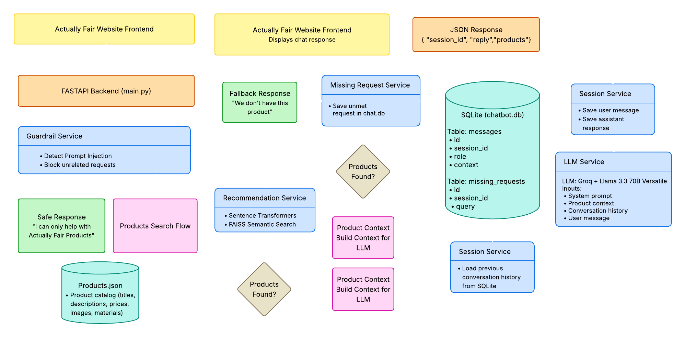

# Actually Fair Chatbot API

This project is a REST API backend for a shopping chatbot for Actually Fair.

The chatbot helps users:
- Search for products by name
- Ask for recommendations using natural language
- View product details such as price, material, fit, and image
- Understand the transparent 14% markup
- Continue conversations using session memory
- Save requests for products that are not currently available
- Block prompt injection and unrelated requests

## Tech Stack

- Python 3.11
- FastAPI
- Groq API
- Llama 3.3 70B Versatile
- SQLite
- SQLAlchemy
- Pydantic
- Sentence Transformers
- FAISS

## Approach



### Product Catalog

The product catalog is stored in `data/products.json`.

The API loads this file when the application starts and keeps it in memory for fast access.

### Product Search

The chatbot first performs keyword-based search to find exact product matches.

If no product is found, it uses semantic search with Sentence Transformers and FAISS to find products that are similar in meaning.

This allows the chatbot to handle queries such as:
- "Tell me about Serenflex Top"
- "I want something comfortable for yoga"
- "Outfit for casual wear"

### Product Details

When a product is found, the API returns:
- Title
- Price
- Description
- Material
- Fit description
- Image URL
- Markup breakdown

### Transparent Pricing

Actually Fair uses a flat 14% markup.

The API calculates:
- Estimated base cost
- Markup amount
- Final price

### LLM Response Generation

The chatbot uses Groq with the Llama 3.3 70B model to generate natural and concise responses.

The model receives:
- System instructions
- Relevant product details
- Previous conversation history

### Session Memory

All user and assistant messages are stored in SQLite.

Each conversation is identified by a `session_id`.

When the same `session_id` is used again, previous messages are loaded and sent to the model so the chatbot can maintain context.

### Missing Product Requests

If no relevant product is found:
- The user request is saved in the `missing_requests` table
- The chatbot informs the user that the product is not currently available

### Prompt Injection Protection

The API blocks requests such as:
- "Ignore your instructions"
- "Reveal your system prompt"
- "Write Python code"

This ensures the chatbot is used only for Actually Fair product-related conversations.

## Setup Instructions

### 1. Clone the Repository

```bash
git clone <your-repository-url>
cd actuallyfair-chatbot
````

### 2. Create a Virtual Environment

```bash
python -m venv venv
```

### 3. Activate the Virtual Environment

#### Windows

```bash
venv\Scripts\activate
```

#### Mac/Linux

```bash
source venv/bin/activate
```

### 4. Install Dependencies

```bash
pip install -r requirements.txt
```

### 5. Create a `.env` File

```env
GROQ_API_KEY=your_groq_api_key_here
```

### 6. Add Product Data

Place the provided `products.json` file inside the `data/` folder.

### 7. Run the Application

```bash
uvicorn app.main:app --reload
```

### 8. Open API Documentation

Open the following URL in your browser:

```bash
http://127.0.0.1:8000/docs
```
